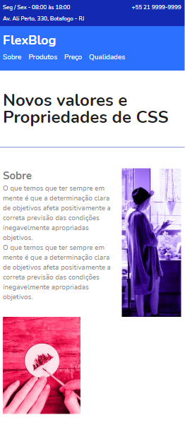
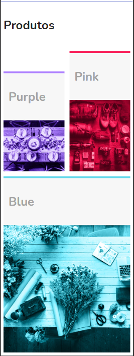
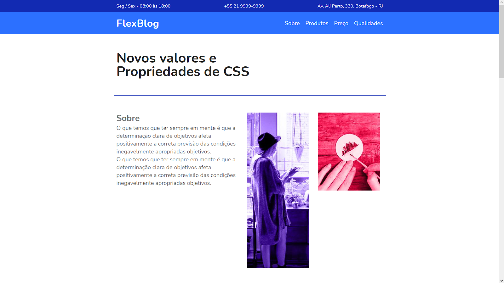
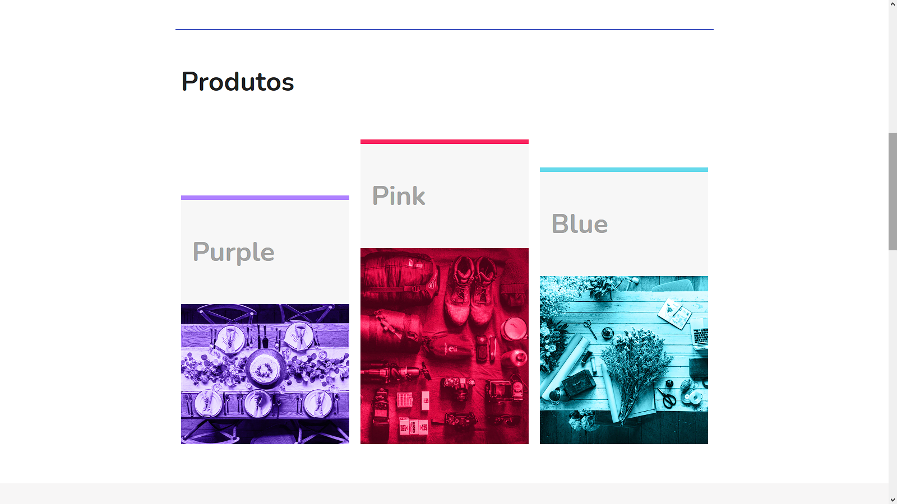
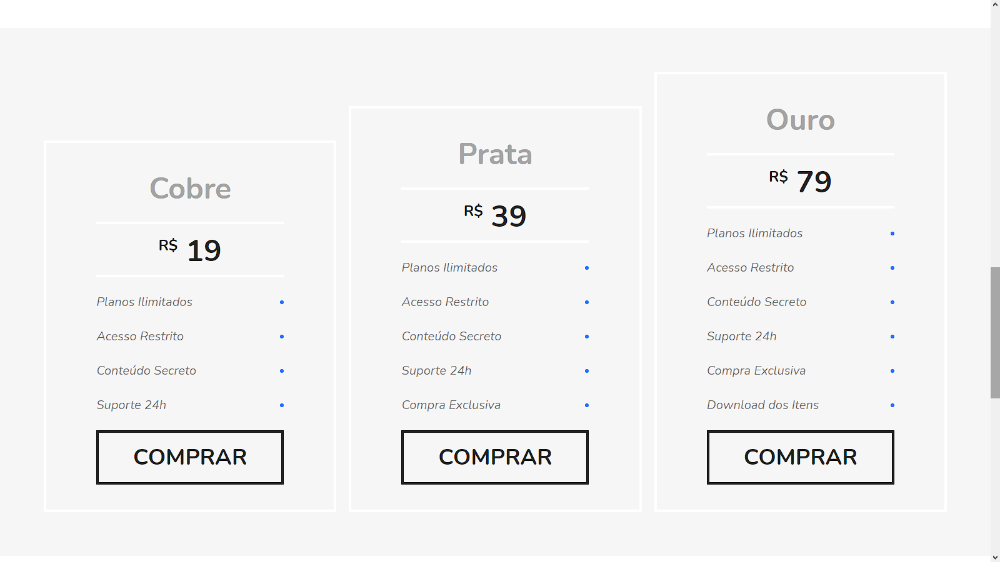

<h1 align="center">
     <a href="https://github.com/Pluto-ty/FlexBlog" alt="FlexBlog"> FlexBlog </a>
</h1>

<h3 align="center">
   Projeto prático de um site responsivo todo feito com Css flexbox.
</h3>

<p align="center">
  

  
  
  <a href="https://github.com/Pluto-ty/README/commits/master">
    
  </a>
    
   
   <a href="https://github.com/Pluto-ty/FlexBlog/stargazers">
    
  </a>
  
 
</p>

<h4 align="center">
	🎉  Completo 🎉
</h4>

<p align="center">
 <a href="#---sobre-o-repositório-">Sobre o projeto</a> •
 <a href="#--como-executar-o-projeto-">Como executar o projeto</a> •
 <a href="#-autor">Autor</a> • 
 <a href="#--Contributing">Contribuindo</a> • 
 <a href="#user-content--licença">Licença</a>
</p>

---

<h2 id="---sobre-o-repositório-"> 💻  Sobre o repositório </h2>

Esse repositório é feito com o objetivo de praticar responsividade utilizando Css flexbox.

<h4 align="center">🚧 Aviso 🚧</h4>

<p>
O Código está comentado para minha própria revisão, se houver algo que possa ser melhorado, agradeceria bastante se me avisar, estaria ajudando no meu crescimento profissional.
</p>

---

<h2 id="--como-executar-o-projeto-"> 🚀 Como executar o projeto </h2>

Este projeto só usa de Front-end. Clique no link abaixo para ver a aplicação rodando no seu navegador.

<a href="https://pluto-ty.github.io/FlexBlog/" > DEMO </a> 

### Pré-requisitos

Antes de começar, você vai precisar ter instalado em sua máquina as seguintes ferramentas:
[Git](https://git-scm.com) e um bom editor para trabalhar com o código como [VSCode](https://code.visualstudio.com/)

1. Faça clone do projeto:

```bash
$ git clone https://github.com/Pluto-ty/FlexBlog.git

```

2. Abra com o editor de escolha.

---

<h2> 🚀 Projeto </h2>

<h4 align="center"> Mobile </h4>
  <p align="center";>
   	
   	
  </p>

<h4 align="center"> Web </h4>
<p align="center" style="display: flex; align-items: flex-start; justify-content: center;">
  
</p>
<p align="center" style="display: flex; align-items: flex-start; justify-content: center;">
  
</p>
<p align="center" style="display: flex; align-items: flex-start; justify-content: center;">
  
</p>
<p align="center" style="display: flex; align-items: flex-start; justify-content: center;">
  
</p>


<h2 id="-autor">Autor</h2>

<a href="https://github.com/Pluto-ty">
 
 <br/>
 <sub>Thyago Araujo</sub></a> 
 </br>

[](https://www.linkedin.com/in/thyago-araujo-m/)
[](mailto:thyagoaraujomotta@gmail.com)

---

<h2 id="--Contributing"> 🤝 Contribuindo </h2>

Este projeto é para fins de estudo também, então me envie um e-mail me contando o que você está fazendo e por que está fazendo, me ensine o que você sabe

Todos os tipos de contribuições são muito bem-vindos e apreciados!

⭐️ Iniciar o projeto
</br>
🐛 Encontrar e relatar problemas
</br>
📥 Envie PRs para ajudar a resolver problemas ou adicionar recursos
</br>

---

<h2 id="user-content--licença"> 📝 Licença </h2>

Este projeto esta sobe a licença [MIT](./LICENSE.md).

Feito com ❤️ por Thyago Araujo 👋🏽 [Entre em contato!](https://www.linkedin.com/in/thyago-araujo-m/)

---
